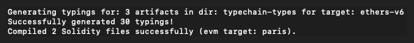
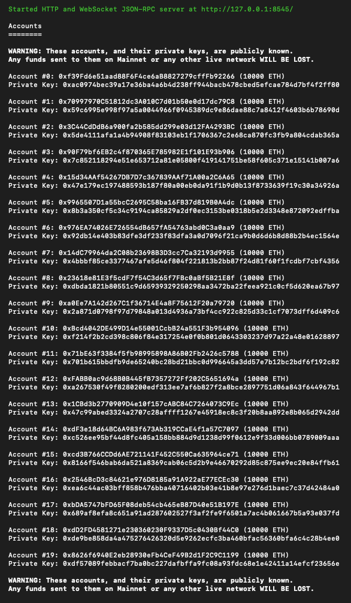
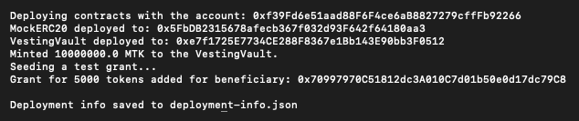
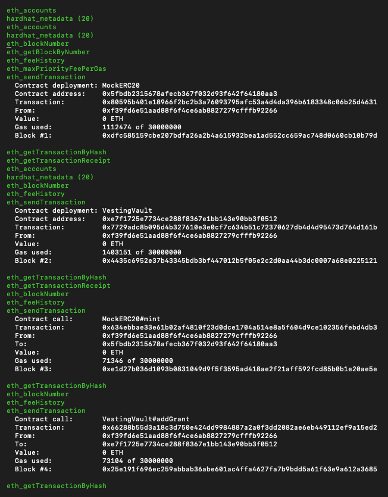
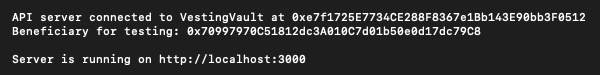
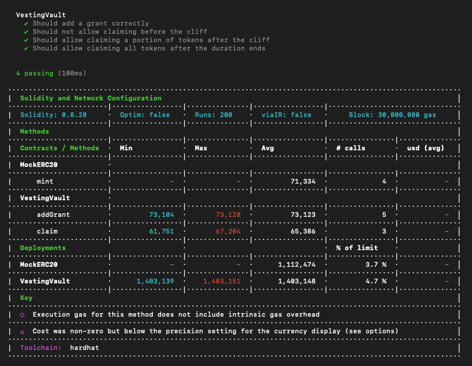

# Vesting Vault (Solidity / Hardhat)

This project implements a Solidity-based `VestingVault` smart contract for managing token vesting schedules.

It includes a full test suite, a deployment script that seeds initial data, and a REST API server to interact with the
contract on a local Hardhat network.

## Prerequisites

- [Node.js](https://nodejs.org/en/download) (v22 or later recommended)
- [npm](https://www.npmjs.com/) (comes with Node.js)

## Setup

1. **Install Dependencies:**
   Navigate to the project's root directory and run the following command to install all required packages:
   ```bash
   npm install
   ```

2. **Compile Contracts:**
   Before running any scripts, compile the smart contracts. This command generates the necessary artifacts and
   TypeScript type definitions.
   ```bash
   npx hardhat compile
   ```

Example of output:



## Running the Project

The project requires four separate terminal windows to run the local blockchain, deploy the contracts, start the API
server, and run tests.

### Terminal 1: Start the Local Blockchain

This command starts a local Hardhat blockchain node, which simulates the Ethereum network on your machine.

```bash
npx hardhat node
````

Example of output:



Keep this terminal running. It will display a list of 20 pre-funded test accounts.

### Terminal 2: Deploy Contracts & Seed Data

This command deploys the `MockERC20` and `VestingVault` contracts to the local node. It also automatically creates a
test vesting grant for the second account (`Account #1`) provided by the Hardhat node.

```bash
npx hardhat run scripts/deploy.ts --network localhost
```

Example of output:



Example of output for the `Terminal 1`, i.e. the terminal with the local node:



After execution, a `deployment-info.json` file will be created in the project root containing the addresses of the
deployed contracts and the test beneficiary.

### Terminal 3: Start the API Server

This command starts the REST API server, which connects to the deployed contracts and exposes endpoints for interaction.

```bash
npx hardhat start-api --network localhost
```

Example of output:



The server will be running on `http://localhost:3000`.

### Terminal 4: Running Tests

To verify the functionality and correctness of the `VestingVault` contract, run the test suite:

```bash
npx hardhat test
```

Example of output:



## API Endpoints

The following endpoints are available for interacting with the smart contract.

The project includes a Postman collection, i.e. `vault-v0.1.postman_collection.json`.

**Note:** The test beneficiary address is deterministic and will always be `0x70997970C51812dc3A010C7d01b50e0d17dc79C8`
in the local Hardhat environment.

-----

### Get Grant Details

Retrieves the details of a vesting grant for a specific beneficiary.

- **URL:** `/grant/:beneficiary`
- **Method:** `GET`
- **Example:**
  ```bash
  curl http://localhost:3000/grant/0x70997970C51812dc3A010C7d01b50e0d17dc79C8
  ```

-----

### Get Vested Amount

Calculates the amount of tokens that have vested for a beneficiary at the current time.

- **URL:** `/vested/:beneficiary`
- **Method:** `GET`
- **Example:**
  ```bash
  curl http://localhost:3000/vested/0x70997970C51812dc3A010C7d01b50e0d17dc79C8
  ```

-----

### Claim Vested Tokens

Allows a beneficiary to claim their available vested tokens. This will execute a transaction on the blockchain.

- **URL:** `/claim`
- **Method:** `POST`
- **Body:**
  ```json
  {
    "beneficiaryAddress": "0x70997970C51812dc3A010C7d01b50e0d17dc79C8"
  }
  ```
- **Example:**
  ```bash
  curl -X POST \
    -H "Content-Type: application/json" \
    -d '{"beneficiaryAddress": "0x70997970C51812dc3A010C7d01b50e0d17dc79C8"}' \
    http://localhost:3000/claim
  ```